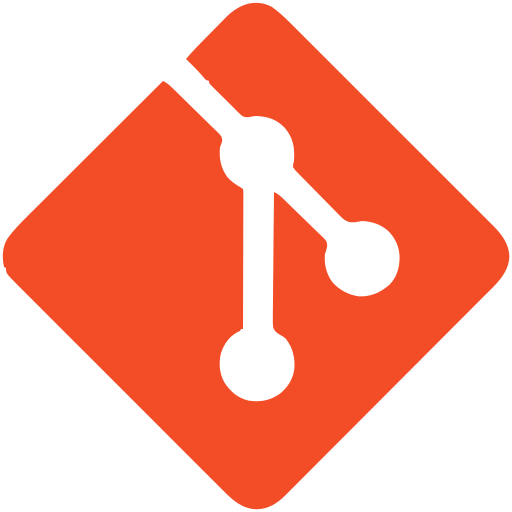

<h1 align="center">Hi, I'm Maulik Shah 👋</h1>

  

  
  
  
  

---

### 🚀 About Me

<table align="center">
  <tr>
    <td valign="middle">
      
    </td>
  </tr>
</table>

---

### 🧰 Tech Stack

  
  
  
  
  
  
  <!--  -->
  
   
  
  
  
  
  
  
  

  
  
  
  
  

---

### 📈 Growth Graph

  

---

### 📊 Heatmap of Contributions

  

---

### 🧩 LeetCode Stats

  

---

<i>Thanks for stopping by — pinned repos below showcase my recent backend projects.</i>

