<h1 align="center">Hi, I'm Maulik Shah 👋</h1>

  

  
  
  
  

---

### 🚀 About Me

- 🎓 Final-year **B.E. Computer Engineering** student at ADIT, Vallabh Vidyanagar (CGPA: 8.89/10, Class of 2027)
- 💼 Backend-focused developer building production-grade systems with **Spring Boot, REST APIs, Microservices, Kafka, Redis, Docker, and AWS**
- 🏗️ Interned at **HulkHire Tech** (PayPal checkout integration with OAuth 2.0 earned the STAR Performer Award)
- 🏆 Hackathon finalist — SSIP Gujarat (Team Awaaz) & Innovation AI Shaping Future (Team Swift AI)
- ☁️ Oracle Cloud Infrastructure (OCI) Foundations Associate certified
- 📌 Actively interviewing for backend / full-stack roles in campus placement drives as well as off campus —  open to connecting!

---

### 🧰 Tech Stack

  <!-- Backend -->
  
  
  
  
  

   

  <!-- Database & Infrastructure -->
  
  
  
  
  

   

  <!-- Development & Observability -->
  
  
  
  
  

---

### 📈 Growth Graph

  

---

### 📊 GitHub Stats

  

  

---

### 🧩 LeetCode Stats

  

---

<i>Thanks for stopping by — pinned repos below showcase my recent backend projects.</i>

